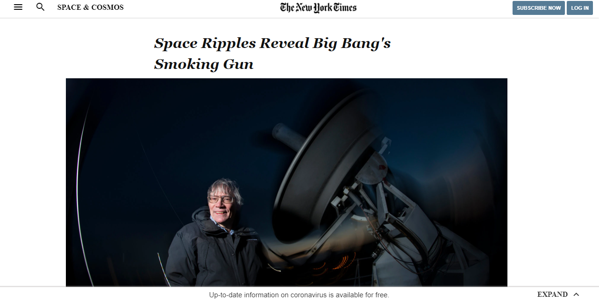
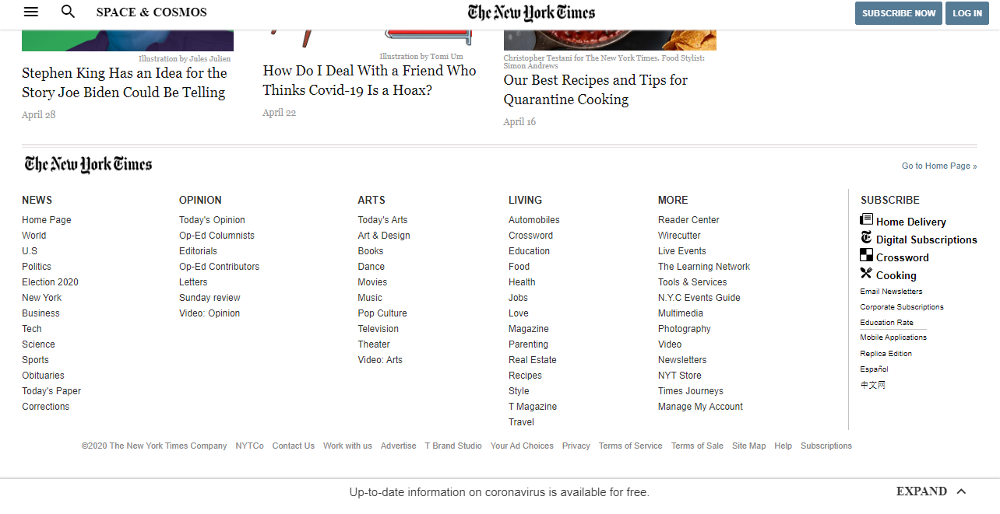

# Project 3 - Positioning and Floating Elements

This is an assigned project where I had to replicate/clone the <a href="https://www.nytimes.com/2014/03/18/science/space/detection-of-waves-in-space-buttresses-landmark-theory-of-big-bang.html?_r=0">New York Times web page.</a>

## Preview of web page

### Top of web page

### Middle of web page

### Bottom of web page

## Built With

- HTML5
- CSS3
- <a href="https://materializecss.com/icons.html">Google icons</a>

## Live Demo

<a href="https://raw.githack.com/chelmerrox/Project-3-Positioning-and-Floating-Elements/project-draft/index.html">Live Demo</a>

## Author

👤 **Losalini Rokocakau**
​
- Github: [@chelmerrox](https://github.com/chelmerrox)
- Twitter: [@chelmerrox](https://twitter.com/chelmerrox)
- Linkedin: [Losalini Rokocakau](https://www.linkedin.com/in/losalini-rokocakau)

## 🤝 Contributing

Contributions, issues and feature requests are welcome!

Feel free to check the [issues page](https://github.com/chelmerrox/Project-3-Positioning-and-Floating-Elements/issues).

## Show your support

Give a ⭐️ if you like this project!

## Acknowledgments

- My Stand-Up Team
- Microverse TSE's
- <a href="https://github.com/BrittanyBlake">My mentor</a>

## 📝 License

This project is [MIT](LICENSE.txt) licensed.
